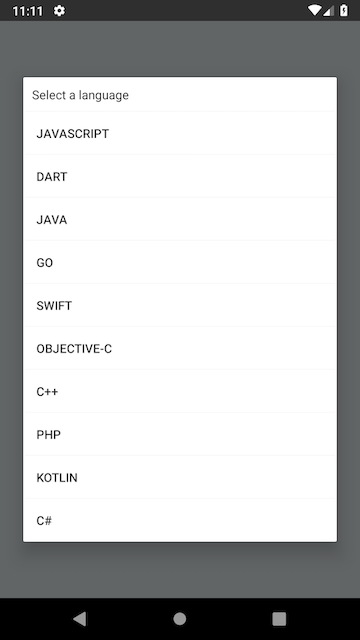
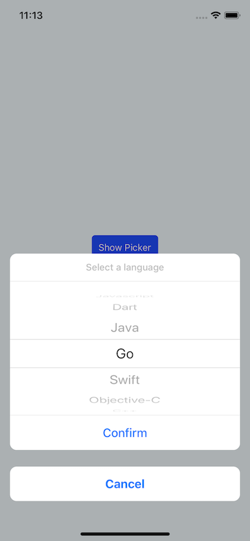

# React Native Picker Module for Android & IOS

With this package you can easily use picker with onPress function.

Using `react-native-modal` and `@react-native-community/picker` component for IOS and using `RecyclerView` and `AlertDialog` for Android as `NativeModule`.


 


## v2.0.3 released.

### v2.0.2 has a lot of breaking changes. You should be carefull when using this version.

### v2.0.3
- PRs merged.

### v2.0.2
- Android input.substr issue solved.

### v2.0.1
- On IOS null value issue solved.

### Version 2.0.0
- useNativeDriver flag added.
- @react-native-community/picker added because picker extracted from core react native
- react-native-modal added to package for IOS
- selectedColor added
- disabled & enabled IOS confirm button styles added.
- Now we can set object array for items or array.
- IOS part start using hooks
- confirmButtonStyle & cancelButtonStyle & contentContainerStyle added
- Adding image to picker item at Android removed. If you need this feature please use v1.3.1
- **And a lot of upgrade...**


## Getting Started

**With YARN**

```
yarn add react-native-picker-module && yarn add react-native-modal && yarn add @react-native-community/picker
```

#### After React Native v0.60.0

```
cd ios && pod install
```

#### Before React Native v0.60.0
**Automatic linking**

```
react-native link react-native-picker-module
```

**Manual Linking**

**[Manual Installation](/docs/manual-installation.md)** (If something went wrong with react-native link)

## Props

| Props       | Type | Default & Description                            | Required | OS         |
|-------------|------|--------------------------------------------------|----------|------------|
|value        |string|-                                                 |**No**        |Android, IOS|
|useNativeDriver|bool|`true`                                            |**No**        |IOS|
|backdropColor|string|-                                                 |**No**        |IOS|
|backdropOpacity|double|`0.7`                                           |**No**        |IOS|
|items        |array / object array |-                                  |**Yes**    |Android, IOS|
|title        |string|-                                                 |**No**        |Android, IOS|
|titleStyle   |object|{}                                                |**No**        |IOS         |
|confirmButtonStyle   |object|{}                                                |**No**        |IOS         |
|cancelButtonStyle   |object|{}                                                |**No**        |IOS         |
|contentContainerStyle   |object|{}                                                |**No**        |IOS         |
|itemStyle    |object|{}                                                |**No**        |IOS         |
|cancelButtonTextStyle |object| {}                                      |**No**        |IOS         |
|confirmButtonEnabledTextStyle|object| {}                               |**No**        |IOS         |
|confirmButtonDisabledTextStyle |object| {}                             |**No**        |IOS         |
|pickerRef    |any   |-                                                 |**Yes**   |Android, IOS|
|onValueChange|func  |(value: string) => void                           |**Yes**   |Android, IOS|
|cancelButton |string|`Cancel`                                          |**No**        |IOS         |
|confirmButton|string|`Confirm`                                         |**No**        |IOS         |
|onCancel     |func  |-                                                 |**No**    |Android, IOS|
|selectedColor|string|-                                                 |**No**    |Android, IOS|


## Usage with Hooks
```javascript
import React, { useRef, useState } from "react"
import { Button, SafeAreaView, Text } from "react-native"
import ReactNativePickerModule from "react-native-picker-module"

const App = () => {
  const pickerRef = useRef()
  const [value, setValue] = useState()
  const dataset_1 = [1, 2, "Java", "Kotlin", "C++", "C#", "PHP"]
  const dataset_2 = [
    {
      value: 101,
      label: "Javascript",
    },
    {
      value: "golang_101",
      label: "Go",
    },
    {
      value: "kotlin_dsl",
      label: "Kotlin",
    },
    {
      value: "java_101",
      label: "Java",
    },
    {
      value: "cplusplus",
      label: "C++",
    },
    {
      value: "csharp_201",
      label: "C#",
    },
    {
      value: "php_201",
      label: "PHP",
    },
  ]
  return (
    <>
      <SafeAreaView>
        <Button title="Select a language" onPress={() => pickerRef.current.show()} />
        <Text>Selected Item Text: {value}</Text>
      </SafeAreaView>
      <ReactNativePickerModule
        pickerRef={pickerRef}
        value={value}
        title={"Select a language"}
        items={dataset_1}
        titleStyle={{ color: "white" }}
        itemStyle={{ color: "white" }}
        selectedColor="#FC0"
        confirmButtonEnabledTextStyle={{ color: "white" }}
        confirmButtonDisabledTextStyle={{ color: "grey" }}
        cancelButtonTextStyle={{ color: "white" }}
        confirmButtonStyle={{
          backgroundColor: "rgba(0,0,0,1)",
        }}
        cancelButtonStyle={{
          backgroundColor: "rgba(0,0,0,1)",
        }}
        contentContainerStyle={{
          backgroundColor: "rgba(0,0,0,1)",
        }}
        onCancel={() => {
          console.log("Cancelled")
        }}
        onValueChange={value => {
          console.log("value: ", value)
          setValue(value)
        }}
      />
    </>
  )
}

export default App

```


## Class Component Example

```javascript
import React from "react"
import { SafeAreaView, Text, Button } from "react-native"
import ReactNativePickerModule from "react-native-picker-module"

const dataset = [
  {
    value: 101,
    label: "Javascript",
  },
  {
    value: "golang_101",
    label: "Go",
  },
  {
    value: "kotlin_dsl",
    label: "Kotlin",
  },
  {
    value: "java_101",
    label: "Java",
  },
  {
    value: "cplusplus",
    label: "C++",
  },
  {
    value: "csharp_201",
    label: "C#",
  },
  {
    value: "php_201",
    label: "PHP",
  },
]
class App extends React.Component {
  constructor(props) {
    super(props)
    this.pickerRef = React.createRef()
    this.state = {
      value: null,
    }
  }
  render() {
    return (
      <>
        <SafeAreaView>
          <Button title="Select a language" onPress={() => this.pickerRef.current.show()} />
          <Text>Selected Item Text: {this.state.value}</Text>
        </SafeAreaView>
        <ReactNativePickerModule
          pickerRef={this.pickerRef}
          value={this.state.value}
          title={"Select a language"}
          items={dataset}
          selectedColor="#FC0"
          onCancel={() => {
            console.log("Cancelled")
          }}
          onValueChange={value => {
            this.setState({
              value: value,
            })
          }}
        />
      </>
    )
  }
}
export default App
```


## FYI
You can use more than one picker in same screen. You just need to set different pickerRef.

p.s : If you want to get country list from native device you can use this package: [https://github.com/talut/react-native-countries](https://github.com/talut/react-native-countries)

## License
This project is licensed under the MIT License - see the LICENSE.md file for details
