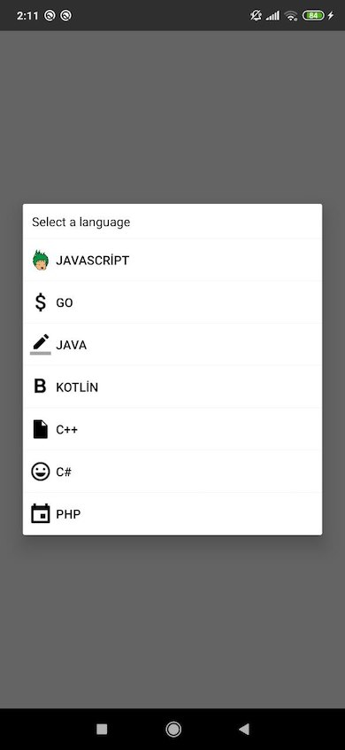

# React Native Picker Module for Android & IOS

With this package you can easily use picker with onPress function.
Also this package is workaround for Android Picker problem (https://github.com/facebook/react-native/issues/15556).

Using `Modal` and `Picker` component for IOS and using `RecyclerView` and `AlertDialog` for Android as `NativeModule`.


 

### Verison 2.0.0
- useNativeDriver flag added.
- You should

## Getting Started

**With NPM**

```
npm install --save react-native-picker-module
```

**With YARN**

```
yarn add react-native-picker-module
```

#### After React Native v0.60 you don't need to link anything. [Native Modules are now Autolinked](https://facebook.github.io/react-native/blog/2019/07/03/version-60#native-modules-are-now-autolinked)

**Automatic linking**

```
react-native link react-native-picker-module
```

**Manual Linking**

**[Manual Installation](/docs/manual-installation.md)** (If something went wrong with react-native link)

## Props

| Props       | Type | Default & Description                            | Required | OS         |
|-------------|------|--------------------------------------------------|----------|------------|
|selectedValue|number|-                                                 |No        |Android, IOS|
|items        |array |-                                                 |**Yes**   |Android, IOS|
|images       |array |If you want to add image to item, images array should be same length as items array |**No**    |Android|
|title        |string|-                                                 |No        |Android, IOS|
|ios          |object|`{duration: 330, overlayColor: 'rgba(0,0,0,0.3)'}`|No        |IOS         |
|titleStyle   |object|{}                                                |No        |IOS         |
|itemStyle    |object|{}                                                |No        |IOS         |
|cancelButtonTextStyle |object| {}                                      |No        |IOS         |
|confirmButtonTextStyle|object| {}                                      |No        |IOS         |
|pickerRef    |func  |-                                                 |**Yes**   |Android, IOS|
|onValueChange|func  |-                                                 |**Yes**   |Android, IOS|
|onCancel     |func  |-                                                 |**No**    |Android, IOS|
|onDismiss    |func  |-                                                 |**No**    |Android, IOS|
|cancelButton |string|`Cancel`                                          |No        |IOS         |
|confirmButton|string|`Confirm`                                         |No        |IOS         |


## Usage with Hooks
```javascript
import React, { useRef, useState } from "react"
import { Button, SafeAreaView, Text } from "react-native"
import ReactNativePickerModule from "react-native-picker-module"

const App = () => {
  const pickerRef = useRef()
  const [value, setValue] = useState()
  const dataset_1 = ["Javascript", "Go", "Java", "Kotlin", "C++", "C#", "PHP"]
  const dataset_2 = [
    {
      value: "js_101",
      label: "Javascript",
    },
    {
      value: "golang_101",
      label: "Go",
    },
    {
      value: "kotlin_dsl",
      label: "Kotlin",
    },
    {
      value: "java_101",
      label: "Java",
    },
    {
      value: "cplusplus",
      label: "C++",
    },
    {
      value: "csharp_201",
      label: "C#",
    },
    {
      value: "php_201",
      label: "PHP",
    },
  ]
  return (
    <>
      <SafeAreaView>
        <Button title="Select a language" onPress={() => pickerRef.current.show()} />
        <Text>Selected Item Text: {value}</Text>
      </SafeAreaView>
      <ReactNativePickerModule
        pickerRef={pickerRef}
        value={value}
        title={"Select a language"}
        items={dataset_2}
        titleStyle={{ color: "red" }}
        itemStyle={{ color: "red" }}
        confirmButtonEnabledTextStyle={{ color: "red" }}
        confirmButtonDisabledTextStyle={{ color: "grey" }}
        cancelButtonTextStyle={{ color: "red" }}
        onCancel={() => {
          console.log("Cancelled")
        }}
        onValueChange={value => {
          console.log("value: ", value)
          setValue(value)
        }}
      />
    </>
  )
}

export default App

```

## FYI
You can use more than one picker in same screen. You just need to set different pickerRef.

p.s : If you want to get country list from native device you can use this package: [https://github.com/talut/react-native-countries](https://github.com/talut/react-native-countries)

## License
This project is licensed under the MIT License - see the LICENSE.md file for details
